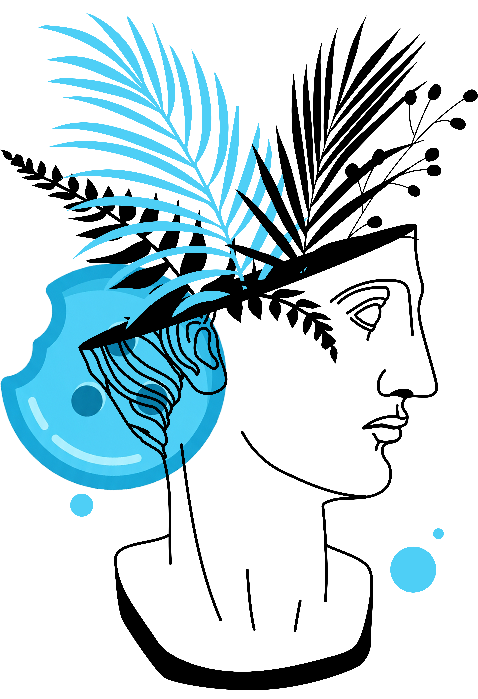

<!-- prettier-ignore -->
<div align="center">



# Receitas

*Plataforma moderna e completa para gerenciamento e reprodução de cursos em vídeo locais.*

[](https://react.dev/)
[](https://www.typescriptlang.org/)
[](https://vitejs.dev/)
[](https://tailwindcss.com/)
[](https://www.python.org/)
[](https://flask.palletsprojects.com/)
[](https://www.docker.com/)

[Recursos](#-principais-recursos) • [Pré-requisitos](#-pré-requisitos) • [Início Rápido](#-início-rápido) • [Atalhos de Teclado](#-atalhos-de-teclado) • [Estrutura do Projeto](#-estrutura-do-projeto)

</div>

---

**Receitas** é uma aplicação web auto-hospedada projetada para transformar suas pastas locais de videoaulas e cursos em uma experiência de aprendizado estruturada, intuitiva e agradável — similar a plataformas como Udemy e Netflix, rodando totalmente offline e sob o seu controle.

A plataforma analisa automaticamente diretórios no seu disco ou servidor, identifica hierarquias de pastas como módulos, cataloga os vídeos com durações exatas via FFmpeg e descobre materiais de apoio anexos (PDFs, códigos-fonte, slides e arquivos compactados).

> [!NOTE]
> Todos os dados de progresso, anotações com marcação temporal e ordem de exibição dos cursos são persistidos localmente no banco de dados SQLite.

---

## ✨ Principais Recursos

- 🎬 **Player de Vídeo Avançado (Video.js)**:
  - Retomada automática (*resume playback*) do ponto onde você parou.
  - Salvamento periódico e inteligente de progresso a cada 10 segundos.
  - Conclusão automática de aula ao atingir 95% do tempo de exibição.
  - Captura instantânea de tela (*Screenshot*) em formato PNG direto dos controles do vídeo.
  - Ajuste fino de velocidade de reprodução (de 0.25x a 3.0x).

- 📂 **Mapeamento Automático de Pastas**:
  - Escaneamento recursivo preservando a árvore de módulos e submódulos.
  - Suporte a múltiplos formatos de vídeo (`.mp4`, `.mkv`, `.avi`, `.mov`, `.webm`, `.ts`, `.flv` e outros).
  - Extração automática de duração das aulas em segundo plano com FFmpeg.

- 📝 **Anotações Sincronizadas com Timestamp**:
  - Crie notas vinculadas ao segundo exato do vídeo em reprodução.
  - Clique no timestamp da anotação para pular instantaneamente para aquele trecho.
  - Edição, exclusão e busca em tempo real em todas as anotações do curso.
  - Exportação completa das anotações em formato **Markdown (`.md`)** ou **Texto Puro (`.txt`)**.

- 📎 **Descoberta Inteligente de Anexos e Materiais**:
  - Detecção automática de materiais complementares (`.pdf`, `.zip`, `.rar`, `.html`, `.docx`, `.py`, `.js`, etc.) localizados nas pastas das aulas ou em diretórios de apoio (`materiais/`, `anexos/`, `extras/`).
  - Download e pré-visualização direta pelo navegador.

- 📊 **Progresso e Produtividade**:
  - Cálculo de porcentagem de conclusão por curso em tempo real.
  - Card de acesso rápido para a última aula assistida.
  - Checkboxes interativas com sincronização otimista e offline.

- 🔀 **Reordenação Drag & Drop**:
  - Organize visualmente a ordem de exibição dos cursos na tela inicial arrastando e soltando os cards (via `@dnd-kit`).

- 🎨 **Interface Glassmorphism Moderna**:
  - Tema escuro imersivo com efeitos visuais fluidos (*liquid blobs*), painéis translúcidos e cursor dinâmico interativo.

---

## 🛠️ Tecnologias Utilizadas

### Frontend
- **Framework & Tooling**: [React 18](https://react.dev/), [TypeScript](https://www.typescriptlang.org/), [Vite](https://vitejs.dev/)
- **Estilização**: [Tailwind CSS](https://tailwindcss.com/) com utilitários de animação e tipografia
- **Componentes**: [Radix UI Primitives](https://www.radix-ui.com/), [Lucide React](https://lucide.dev/)
- **Player & Mídia**: [Video.js](https://videojs.com/) com skins e extensões customizadas
- **Interatividade**: [@dnd-kit](https://dndkit.com/) para drag-and-drop, [Sonner](https://sonner.emilkowal.ski/) para notificações
- **Renderização Markdown**: [React Markdown](https://github.com/remarkjs/react-markdown) e [Remark GFM](https://github.com/remarkjs/remark-gfm)

### Backend
- **Core**: [Python 3.11](https://www.python.org/) com [Flask](https://flask.palletsprojects.com/)
- **ORM & Banco de Dados**: [SQLAlchemy](https://www.sqlalchemy.org/) / [Flask-SQLAlchemy](https://flask-sqlalchemy.palletsprojects.com/) com SQLite
- **Processamento de Mídia**: [FFmpeg](https://ffmpeg.org/) para inspeção de metadados e duração
- **Contêineres**: [Docker](https://www.docker.com/) e [Docker Compose](https://docs.docker.com/compose/)

---

## 📋 Pré-requisitos

Para executar a aplicação com Docker (método recomendado):
- [Docker](https://docs.docker.com/get-docker/) e [Docker Compose](https://docs.docker.com/compose/install/) instalados.

Para execução manual em desenvolvimento local:
- [Node.js](https://nodejs.org/) (versão 18 ou superior) e [npm](https://www.npmjs.com/)
- [Python](https://www.python.org/) (versão 3.10 ou 3.11)
- [FFmpeg](https://ffmpeg.org/download.html) instalado e adicionado ao `PATH` do sistema

---

## 🚀 Início Rápido

### Opção 1: Executando com Docker Compose (Recomendado)

1. Clone o repositório ou navegue até o diretório do projeto:
   ```bash
   cd Receitas
   ```

2. Configure o caminho da sua pasta de cursos no arquivo `docker-compose.yml`:
   ```yaml
   services:
     back-end:
       volumes:
         - C:\Caminho\Para\Seus\Cursos:/courses:ro  # Substitua pelo caminho local dos seus cursos
   ```

3. Inicie os contêineres:
   ```bash
   docker compose up -d --build
   ```

4. Acesse a aplicação no seu navegador:
   - **Frontend**: [http://localhost:5050](http://localhost:5050)
   - **Backend API**: [http://localhost:9823](http://localhost:9823)

> [!TIP]
> No Linux ou macOS, ajuste o caminho do volume no `docker-compose.yml` para o formato Unix (ex: `/home/usuario/Cursos:/courses:ro`).

---

### Opção 2: Executando Manualmente em Desenvolvimento

<details>
<summary><b>1. Configurar e Iniciar o Backend</b></summary>

```bash
# Entre na pasta do backend
cd backend

# Crie e ative o ambiente virtual
python -m venv venv

# No Windows:
.\venv\Scripts\activate
# No Linux/macOS:
source venv/bin/activate

# Instale as dependências
pip install -r src/requirements.txt

# Inicie o servidor da API (porta 9823)
python src/app.py
```
</details>

<details>
<summary><b>2. Configurar e Iniciar o Frontend</b></summary>

```bash
# Em outro terminal, entre na pasta do frontend
cd frontend

# Instale as dependências
npm install

# Inicie o servidor de desenvolvimento Vite
npm run dev
```

Abra o endereço exibido no terminal (geralmente [http://localhost:5173](http://localhost:5173)).
</details>

---

## ⌨️ Atalhos de Teclado

Durante a reprodução de um vídeo, você pode utilizar os seguintes atalhos para controle ágil:

| Tecla / Combinação | Ação |
| :--- | :--- |
| <kbd>Espaço</kbd> ou <kbd>K</kbd> | Alternar entre Reproduzir / Pausar |
| <kbd>J</kbd> | Voltar 10 segundos |
| <kbd>L</kbd> | Avançar 10 segundos |
| <kbd>←</kbd> (Seta Esquerda) | Voltar 5 segundos |
| <kbd>→</kbd> (Seta Direita) | Avançar 5 segundos |
| <kbd>↑</kbd> (Seta Cima) | Aumentar volume em 10% |
| <kbd>↓</kbd> (Seta Baixo) | Diminuir volume em 10% |
| <kbd>F</kbd> | Alternar modo Tela Cheia |
| <kbd>M</kbd> | Ativar / Desativar mudo |
| <kbd>Shift</kbd> + <kbd>&lt;</kbd> (ou <kbd>,</kbd>) | Diminuir velocidade de reprodução |
| <kbd>Shift</kbd> + <kbd>&gt;</kbd> (ou <kbd>.</kbd>) | Aumentar velocidade de reprodução |
| <kbd>Shift</kbd> + <kbd>P</kbd> | Ir para a aula anterior |
| <kbd>Shift</kbd> + <kbd>N</kbd> | Ir para a próxima aula |

---

## 📖 Como Cadastrar um Curso

1. Acesse a página inicial e clique no botão **"Novo Curso"** no canto superior direito.
2. Informe o **Nome do Curso**.
3. No campo **Caminho da Pasta**, informe o caminho absoluto do diretório onde as videoaulas estão armazenadas (ex: `C:\Cursos\Curso-React` ou `/courses/Curso-React`).
4. *(Opcional)* Selecione uma imagem de capa local ou informe a URL de uma imagem da web.
5. Clique em **Salvar**. O backend fará a varredura recursiva de todas as subpastas, registrará as aulas e calculará as durações automaticamente.

> [!IMPORTANT]
> Ao utilizar Docker, certifique-se de que a pasta cadastrada esteja dentro do volume mapeado em `/courses` no contêiner do backend.

---

## 📁 Estrutura do Projeto

```text
Receitas/
├── docker-compose.yml        # Orquestração dos serviços frontend e backend
├── backend/
│   ├── Dockerfile            # Configuração do contêiner Python 3.11 com FFmpeg
│   └── src/
│       ├── app.py            # Inicialização do Flask e modelos SQLAlchemy (Course, Lesson, Note)
│       ├── routes.py         # Endpoints da API REST e streaming de conteúdo
│       ├── utils.py          # Lógica de escaneamento de diretórios e módulos
│       ├── video_utils.py    # Extração de duração via FFmpeg
│       └── requirements.txt  # Dependências Python
└── frontend/
    ├── Dockerfile            # Build multi-stage com Nginx
    ├── package.json          # Dependências React, Vite, Tailwind e Video.js
    └── src/
        ├── components/       # Componentes de UI, player, cards, anotações e anexos
        ├── hooks/            # Hooks de dados, player e gerenciamento de API
        ├── pages/            # Páginas da aplicação (Cursos, Visualizador de Curso, Configurações)
        └── routes/           # Configuração de rotas com React Router
```
